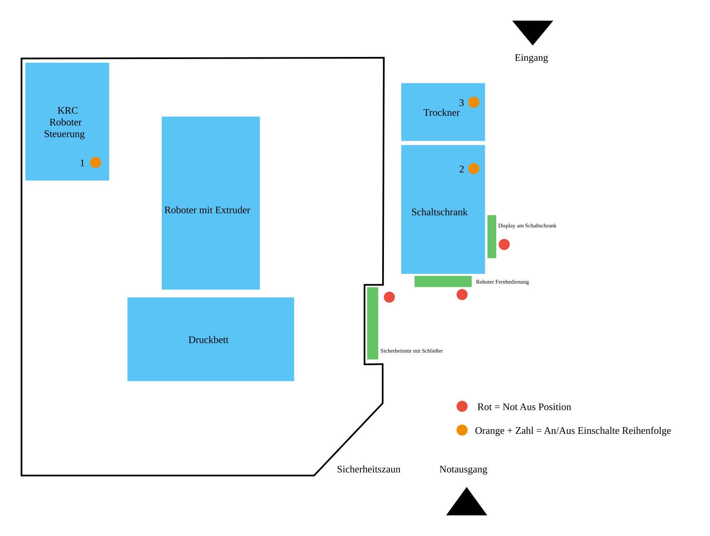

# Commissioning & Operating Manual – 3D Printing Robot System DXR25 (Weber Additive)
FH Münster – MSA Robotics Lab

This manual consolidates the induction, transcripts, and meeting notes. It serves as a binding reference for all trained users of the DXR25.

## Table of Contents
1. Purpose and Scope
2. Safety & Preparation
   - General, Ventilation & Door Policy
   - Personal Protective Equipment (PPE)
   - Temperature/Burn Hazard
   - Emergency Stop (E‑Stop)
3. System Layout & Component Overview
4. Preparations Before Start (Quick Check)
5. Powering On the System (Sequence)
6. Software Startup & Basic Configuration
7. Materials & Temperature Profiles
8. Extruder Cleaning & Material Change
9. Nozzle & Build Plate
10. Loading G‑code/DXR Files
11. Starting a Print (Preview, Offsets, Start Speed)
12. Post‑Processing & Shutdown
13. Troubleshooting
14. Maintenance & Regular Checks
15. Notes & Open Points
16. DXR25 Quick‑Start Checklist
17. Credits
18. Appendix – DXR Code Example (complete)

---

## 1. Purpose and Scope
The DXR25 is an industrial 6‑axis KUKA robot with a Weber pellet extruder for large‑format 3D printing. This manual describes safe commissioning, operation, typical error patterns, and care measures. Operation is strictly limited to trained personnel.

## 🧱 2. Safety & Preparation

> Emergency Quick Guide (memory box)
> 1) Stop immediately: “Stop print” → if danger: press E‑Stop (display, fence, or smartpad)
> 2) Check heater zones: verify nozzle/zone temperatures in the HMI; do not touch hot parts
> 3) Secure area: keep the door interlocked, only move the robot after a visual inspection
> 4) Root cause analysis: read the message text, check drive load, verify offsets/program
> 5) Restart: only after fixing the issue and another visual and collision check

### 2.1 General, Ventilation & Door Policy
- Ventilate the room before each use (occupational safety guideline, 5–10 minutes). While present, the door may remain open; always close it when leaving (safety area!).
- Do not leave the safety area open and unattended. Access to the robot cell is for trained personnel only.
- If you notice unusual noises, smell, vibrations, or anomalies, stop the print immediately; press E‑Stop if necessary.
 - Only start a print with a direct line of sight to the robot; keep the printing area clear (no obstacles in the workspace).
 - In Rhino/Grasshopper (Robot plugin), configure safety fences and collision objects appropriately, especially for multi‑axial jobs.

### 2.2 Personal Protective Equipment (PPE)
- Use heat/fire‑resistant gloves when working on the extruder/nozzle (located in the lab near the Ginger printers).
- Tie up hair, avoid loose clothing or jewelry/metal in the safety area.

### 2.3 Temperature and Burn Hazard
- Heated bed: up to 150 °C. Nozzle/extruder: up to 250–280 °C.
- Never touch hot areas. If needed, cautiously check temperature with the back of your hand (not the palm!).
- Keep the magnetic build plates placed on the heated bed when it’s on (to avoid fumes). Align plates without gaps/overlaps.

### 2.4 Emergency Stop Buttons
- Three E‑Stop positions: 1) on the display 2) on the safety fence 3) on the KUKA smartpad.
- Press only in an emergency (e.g., collision, overheating, erroneous motion). The system must be re‑initialized afterwards.

> Note: There is no software ground‑collision lockout. Start new programs/offsets with extra caution and monitor Z height.

---

## ⚙️ 3. System Layout & Component Overview

### System Layout Plan



*Figure: Weber DXR25 3D printing robot system layout with startup sequence (1→2→3)*

### Component Overview

| Component | Description |
|---|---|
| KUKA industrial robot | KUKA KR120 (6‑axis arm), controlled via KUKA controller |
| Weber extruder | Screw extruder feeds and plasticizes pellets; multiple heating zones |
| Overpressure safety device | Mechanical safety at the extruder head; trips when jam/material too cold; replace all screws after triggering |
| Pellet feed & dryer | Dries material and feeds it pneumatically into the extruder; must run during printing |
| Water cooling (chiller) | Closed loop, automatic; check fill level periodically |
| Heated bed | Heated up to 150 °C, with magnetic plates |
| Safety fence & door interlock | Electrically coupled; interlock before starting a print |
| Control cabinet | Industrial PC, extruder control, safety/communication modules; main switch for commissioning |
| Display / operator unit | Touch, rotary/push knob, USB ports, confirm/abort buttons, E‑Stop. Note: On the touch display/control cabinet currently only the right USB port is usable; the left one is internally occupied. |
| Camera | Monitors the printing process (access via link when robot is active) |
| Activated carbon filter (optional) | Manual air purification against odors; can run on a timer |

Additional notes from induction:
- Spare screws for the overpressure safety device are located on the shelf above the robot controller. After triggering, discard and replace all affected screws. Tightening: “hand‑tight + ¼ turn” (guideline; use a torque wrench if needed).
- Only change control cabinet keys and camera/network connections in consultation with the workshop lead/manufacturer.

---

## ✅ 4. Preparations Before Start (Quick Check)
- Room ventilated, area clear, plates correctly placed.
- Cooling/chiller visually checked (fill level plausible). Switch on activated carbon filter if needed.
- Material: only PETG/PLA (approved). Switch on dryer and check fill level.
- Close safety area: check door mechanism; activate interlock only when starting.
- Visual inspection extruder/nozzle: no damage, overpressure safety intact, nozzle tight.

---

## 🔌 5. Powering On the System (Sequence)
1. Finish ventilation & visual inspection.
2. Switch on the robot controller (KUKA controller).
3. Switch on the control cabinet main switch; check indicator lights.
4. Let the display boot → Windows starts → Weber software launches automatically.

Login to the software: user “Operator”, password “222”.

---

## 🧭 6. Software Startup & Basic Configuration
After login:
- Check and acknowledge notifications (red/yellow icons at the top right).
- Activate safety: close the door → white button blinks → press → system interlocks.
- Perform brake test: Drives → Home position → Brake test. Keep the area clear.

Switch KUKA to external operating mode (if required):
- Close and acknowledge the cell door, press the system‑on button (lit), enable drives.
- On the smartpad select the program “cnc”; hold any enabling switch in the middle position.
- Press and hold any start button; observe SAK motion.
- Turn the key switch; set operating mode to EXT.
- Perform brake test/reference run; move to home position.

---

## 🔥 7. Materials & Temperature Profiles
Approved materials: PETG, PLA. Others (e.g., recycled) only with written approval.

Heating zones in the software:
- Feed/conveying zone (top, possibly actively cooled)
- Process zone (middle)
- Nozzle adapter/nozzle (bottom)

Recommendations:
- Load recipe “PETG 3 mm” (typically approx. 230 °C, depending on material and nozzle).
- Disable part cooling/fan initially (better adhesion), enable later as needed.
- Keep the dryer running throughout the print. If the dryer runs empty, material flow stops; restart without refilling is not possible. A software update for pause functionality has been announced.

Material factor (P1):
- Extrusion volumes in DXR can be scaled with a material factor P1 (e.g., PETG ~3.1, PLA ~3.5 as starting values, depending on recipe/nozzle). Adjust in the machine UI, not in the Grasshopper script. Document changes and calibrate when feasible.

Tuning/HMI overview (Weber software):
- Left panels: extruder heating zones (feed/process/nozzle adapter), clean extruder, retract screw.
- Right panels: build table (master temperature, zones 1–4, vacuum set/actual), robot status (position X/Y/Z, TCP override 10–200%).
- Submenu (right screen bar): Start screen, process settings, nozzle list, build plate list, formula collection, recipes, G‑code, screen cleaning, explorer, trend graphs.
- Note: The G‑code/DXR program may reside in `C:\\ProgramData\\Weber\\GCode\\` or `D:\\Data\\Gcode` depending on the system.

Baseline temperatures (guidelines for first prints – fine‑tune per nozzle/material):
- Feed zone: 35–60 °C (material dependent)
- Heat zone 1/2/3: 160–235 °C (PLA lower, rPETG/carbon‑filled higher; follow vendor specs)
- Nozzle temperature: approx. 180–240 °C (material dependent)
- Build table: 60–100 °C (adhesion depends on substrate)
- Material drying: 4–6 h at ~60–65 °C (material dependent)

Determining the material factor (practical guide):
1. Print a single‑wall geometry; set line width slightly above nozzle Ø (e.g., 1.2×).
2. Measure/compare target vs. actual line width.
3. Adjust factor: new factor = (target width / actual width) × current factor.
4. Print again and verify; re‑validate after changes in nozzle/temperature/cooling.

Influences and corrections (quick reference):
- Temperature too low: poor adhesion, high torque, rough surface → increase temp (increase lower zones = higher exit temp), reduce cooling, possibly increase speed.
- Temperature too high: oozing/stringing, overheating, layer delamination → decrease temp (lower zones), increase cooling, reduce layer height.
- Material factor too low: voids, poor adhesion → increase factor; adjust dynamics if needed.
- Material factor too high: material buildup, imprecise contours → reduce factor; check strategy/dynamics/nozzle.
- Cooling too low: overhangs sag, bridges drip, warping → increase cooling, lower temp, thinner layers/smaller nozzle/longer layer time.
- Cooling too high: poor adhesion, warping, dull surface → reduce cooling, increase temp, increase layer height.
- Bed/substrate: If adhesion is low → reduce nozzle distance, slightly increase bed temp, clean/degrease bed, use adhesion promoter; If adhesion is too high → increase distance, lower bed temp, use alternative substrate.
- Nozzle shape: pointed = sharper corners, less adhesion; flat = wider bead, more adhesion. Long nozzle: more clearance for multiaxis; short nozzle: less heat loss, higher collision risk. Large nozzle = high output, good adhesion but poorer contour; small nozzle = good contour, longer print time.

---

## ♻️ 8. Extruder Cleaning & Material Change
Before each print:
1. Fully heat the extruder (at least 15 minutes until setpoint reached).
2. Execute “Clean extruder”.
3. Monitor “drive load”: blue = OK, orange/red = stop immediately (overpressure hazard).
4. Check material flow: uniform, plastic extrusion.

Material change:
- Move robot to maintenance position.
- Discharge remaining material into a bucket in a controlled manner (do not waste). Only loosen screws at the extruder head if necessary.
- After malfunction/material jam: check overpressure safety; after triggering, replace all screws (spares on the shelf above the robot controller).

Extruder cleaning (per manufacturer notes):
- Completely purge previous material.
- Fill cleaning granulate and extrude fully.
- Clean feed lines up to the feed zone; remove granulate residues in the feed zone with compressed air via the material feed.

Woywod dryer emptying/cleaning (for material change):
- Place a container underneath; open rotary/slide valve and empty the container.
- Switch on conveying to empty the feed hose.
- Remove remaining material: clean feed opening and interior; remove/clean grid; open valve and clean with compressed air; remove/clean filter.
- Note: Wear a dust mask for fiber‑filled materials. Fill in new material and dry.

---

## 🧰 9. Nozzle & Build Plate
Nozzle change:
- Perform only at operating temperature (material soft). Use a 13 mm wrench.
- Loosen old nozzle counterclockwise; install new nozzle using suitable metal paste.
- Tighten: hand‑tight + ¼ turn (guideline). Check for leaks after the first heat‑up.
- Layer width: approx. 1.2–2× nozzle diameter (e.g., Ø 3 mm → 3.5–6 mm).

Additional (manufacturer’s note):
- Change the nozzle in heated condition; coat sealing surfaces/threads of the new nozzle with heat‑resistant metal lubricant paste.
- Low torque (~15 Nm) is sufficient; stop if noticeable resistance occurs.

Build plate:
- Keep magnetic plates in place (avoid odor/fume generation). No open gaps/overlaps.
- Typical bed temperature: 60–90 °C. Do not touch; back‑of‑hand test only with caution.

---

## 💾 10. Loading G‑code/DXR Files
1. Weber software → “G‑code table”: check available print files.
2. Data transfer: via USB stick or TeamViewer.
3. File path: `D:\\Data\\Gcode`.
4. If the file does not appear: stop runtime → open Explorer → check network connection “NC”. If the symbol is red, click to restore the connection.
5. Copy DXR files from the post‑processor into the G‑code folder.

Notes on file conversion (DXR):
- The machine processes DXR files, not G‑code directly. The recommended procedure is automatic conversion via Rhino/Grasshopper script (LargerSlicer.gh or LargerSlicerMultiaxial.gh) with the robot plugin.
- Alternative at the control cabinet: use the Weber converter (taskbar icon → black window). Drag and drop G‑code into the window, press Enter. The generated .dxr must then be copied into the G‑code folder, otherwise it will not appear in the Weber software.

Remote access:
- TeamViewer is available for short sessions (no Pro license; typically ~5 minutes). Access data can be viewed on the Windows system (TeamViewer app/Explorer).
- Windows Remote Desktop may be available (check/enable on site).

Important HMI/file-handling notes:
- **Tap File Explorer only once on the HMI.** Repeated tapping can cause instability/crashes because all queued clicks may still be processed in sequence.
- **If a `.dxr` file takes unusually long to load**, the file is often corrupted. Check it in a text editor (for example empty/incomplete/invalid content) and re-export if needed.
- **Keep file names short and clean.** Very long file names, special characters, or extra dots in the file name can break import or crash the system.
- **Important:** Use only **one dot directly before the extension**. Example problematic name: `examplename_23h12min_1.23kg.dxr` (extra dot before `.dxr`).
- **Do not connect very large USB drives when the system is slow.** Indexing can significantly delay operation.
- **Recommended alternative if USB transfer is too slow:**
   1. Stop Runtime from the menu.
   2. Open TeamViewer from the Windows taskbar (bottom right).
   3. Enter connection credentials/password.
   4. Transfer files within the available short session window (typically about 5 minutes).

Requirements for the Rhino/Grasshopper workflow:
 - Rhino 8 or newer with robot plugin installed. Note: Runs only on Rhino 8+ due to Python‑2 scripts.
 - **Install the plugin (two options):**
   
   **Option 1: Rhino Package Manager (recommended)**
   1. In Rhino, run the command `PackageManager`
   2. Search for "LARGERslicer"
   3. Click "Install"
   4. Restart Rhino/Grasshopper
   
   **Option 2: Manual Installation**
   - Copy the following files into the Grasshopper Components folder, then restart Rhino/Grasshopper:
     - LargerSlicer.gha
     - Newtonsoft.Json.dll
     - Optional: LargerSlicer.pdb (debug symbols)

 - Download/open the .gh files as needed (LargerSlicer.gh or LargerSlicerMultiaxial.gh). Important: These Grasshopper files require the plugin (GHA + DLL) installed to run.

### ⚠️ First-Time Setup: Robot Library Installation (KUKA KR120)

**Important:** When you open the Weber Grasshopper script for the first time, **no robot will be displayed**. This is because the KUKA KR120 robot library from FH Münster MSA needs to be installed in the Robots plugin.

**The Robot component will appear red/broken** – this makes it easy to find!

**Steps to install the KUKA KR120 robot:**
1. Locate the **red Robot component** in your Grasshopper canvas (it's broken/red because the library is missing)
2. **Double-click** the **Libraries** button on the Robot component
3. In the library browser window, navigate to the **FH Münster MSA** tab
4. **Download and install** the **KUKA KR120** robot library
5. **Save** your Grasshopper definition
6. **Close** and **reopen** the Grasshopper file
7. The KUKA KR120 robot should now be visible in the simulation and the component will turn green

> **Note:** The robot library only needs to be installed once per Rhino installation. After the first setup, the KUKA KR120 will be available for all future Weber DXR25 projects.

**Additional setup steps:**
 - Set safety fences/collision objects correctly in the scripts.

DXR quick reference:
- DXR mirrors G‑code lines with N numbers, XYZ, G90/G91 and orientations A/B/C.
- Extrusion is scaled with `XE=[value*P1]`, where P1 is the material factor in the machine UI.
- Example: `N24 G1 X911.817 Y952.527 Z32.000 A0.000 B0.000 C0.000 G91 XE=[64.430*P1] G90`

A complete DXR example is provided in the appendix.

HMI/G‑code lists & paths:
- Accessible via the right HMI menu: recipes, nozzle list, build substrates, formula collection, G‑code overview.
- DXR files are located, depending on the system, in `D:\\Data\\Gcode`.

---

## ▶️ 11. Starting a Print (Preview, Offsets, Start Speed)
Before starting, check:
- Recipe loaded, material correct, extruder cleaned.
- Door interlocked (white → pressed), safety active.
- Bed and nozzle temperatures reached.

Procedure:
1. Jobs are started and monitored at the control cabinet/display, not on the KUKA pendant.
2. Maintenance position → home position.
3. Press “Start print”.
4. Start window: verify part dimensions; set XY/Z shift; set extruder orientation (tilt/rotation); enable “Auto nozzle offset” if needed; enable “Traverse build volume” (move to min./max. limits); enable “Wipe before print start/layer change” as required.
5. Check the preview; set offsets carefully. Watch for Z collision risk.
6. Start with a reduced override (10–50%); increase gradually after stabilization. After nozzle/plate changes, re‑measure nozzle–table distance.

Notes on multi‑axial printing:
- Multi‑axial printing uses additional orientations (A/B/C axes). With A=B=C=0 the extruder is vertical for horizontal printing. Orientations are defined via planes in the multi‑axial Grasshopper script.
- Before multi‑axial jobs, check potential collisions between extruder and robot arm; consider using a raised table/fixture.
- Prefer extruder tilt toward the wall / largest free area (away from the safety door side), especially for 45 degree jobs.
- Keep additional clearance near the fence; the protected braking zone can begin before the physical barrier.

---

## 🧯 12. Post‑Processing & Shutdown
1. End the printing process and let it cool down; remove the part from the bed only below < 50 °C.
2. Switch off heaters; keep cooling/chiller running until < 50 °C.
3. Move the robot to the home position.
4. Shut down the system: close Weber runtime → shut down Windows → switch off control cabinet → switch off robot controller.
5. Unlock the door; tidy up the workplace, dispose of material leftovers, clean the floor.

---

## 🧩 13. Troubleshooting

For the maintained master version (EN/DE), also see: [KUKA Robot Troubleshooting Guide](../../../LARGERslicer/documentations/KUKA_ROBOT_TROUBLESHOOTING.md).

| Problem | Possible cause | Action |
|---|---|---|
| No extrusion | Extruder not hot enough / not fully heated | Continue heating (> 15 min), then “Clean extruder” |
| Drive load orange/red | Overpressure due to cold material/clog | Stop immediately, check temperature, clean extruder |
| Overpressure safety trips | Material jam, too cold, wrong material, nozzle collision | Stop print, check extruder head, replace all safety screws |
| Nozzle collides with bed | Wrong Z offset/program error | Stop/E‑Stop immediately, check offsets, inspect bed/nozzle |
| “NC” connection missing | Network path disconnected | Open Explorer, reconnect “NC”, reload file |
| Endless loading at job start | Incorrect start order/NC connection | At the top right: stop runtime → open Explorer → click the “NC drive” in the sidebar (symbol switches from red to green) → load job again |
| Temperature indicator red/error | Heater/sensor fault | Do not continue printing; inform workshop/manufacturer |
| System blows/cools unusually loudly | Robot room too warm / high thermal load | Ventilate the robot room, increase air exchange, stabilize ambient temperature |
| Strong odor | Plates removed / filter off | Place plates; switch on activated carbon filter; ventilate |
| Print stops when dryer empty | Dryer empty; no pause mode | Refill material; print cannot be resumed without update |
| Reference run fails; robot cannot find startup reference | Reference switch bent, shifted, or loose | At the reference position, verify that both indicator lamps switch correctly; carefully readjust or re-mount the reference switch until homing works reliably again |

KUKA controller/program stuck (e.g., singularity):
- First try to jog the robot out of the situation manually (teach‑in, slowly, area clear!).
- Check status LEDs on the KUKA pendant (all top‑right LEDs should be green). If not, follow the on‑screen instructions until green.
- Reload or restart the CNC/program (do not delete). If needed, toggle between external/internal control (key switch top right) and try again.

### Issue: Robot does not perform brake test / start movement after startup

**Symptoms:**
- Robot does not perform required brake test / start movement after startup
- Robot cannot move to home position
- Drive button blinks continuously
- Error message: "Druck abgebrochen bei XYZ jeweils 0" (Pressure aborted at XYZ all 0)
- Control cabinet display shows: "Neu Starten" (Restart) or "Warnschwelle für Bremstest erreicht mit 0 Stunden Restlaufzeit" (Brake test warning threshold reached with 0 hours remaining runtime)
- Corresponding indicator light is red

**KUKA Smart Remote / Smartpad Display Shows:**
- "Quitt Fahrtfreigabe gesamt Verursacher KS" (Acknowledge overall drive enable cause KS)
- "Active-Status erforderlich" (Active status required)
- Status indicators "S" "O" "R" "Ext" show: Green, Gray, Yellow, Green (or similar)
- **Expected:** All indicators should be green on the Smartpad

**Root Cause:**
The CNC program on the robot controller needs to be manually reselected.

**Solution (Work on Smartpad Only):**

1. **Switch Key Position:**
   - Turn the key from "Remote" to "Zahnrad" (Gear icon) position

2. **Enter T1 Mode:**
   - Navigate to T1 mode
   - Then switch back: Turn key from "Zahnrad" to "Remote"

3. **Open Navigation:**
   - Tap the blue gear icon on the left side of the touchscreen
   - Click "Öffnen" (Open)
   - Tap the orange "X" on the left side
   - This opens the navigation overview

4. **Select CNC Program:**
   - Multiple files and folders are displayed
   - Click on "cnc"
   - Tap "Anwählen" (Select) at the bottom of the touch display

5. **Reset Program:**
   - At the top of the Smartpad touchscreen, tap the yellow square "R"
   - A window opens
   - Click: "Programm zurücksetzen" (Reset program)

6. **Return to External Mode:**
   - Turn key to "Zahnrad" (Gear icon) position
   - Select external mode "EXT"
   - Turn key back to "Remote" (Fernbedienung)

7. **Verification:**
   - Robot should now be able to move again
   - All status indicators on Smartpad should be green

### Issue: Emergency stop near safety fence during multiaxial printing

**Symptoms:**
- Robot stops abruptly when the tool/extruder approaches fence-near regions
- Brakes engage audibly and robot is set out of operation
- HMI/control cabinet shows safety-stop or brake-test related messages
- Robot cannot continue automatic motion until manually moved out of protected area

**Root Cause:**
TCP/extruder tilt enters the protected braking zone during multiaxial path segments (commonly on 45 degree orientations).

**Recovery (KRC5 / Smartpad):**

1. **Read status message first:**
   - Confirm stop reason on HMI/Smartpad or control-cabinet display.

2. **Switch to setup movement mode:**
   - Turn key from "Remote" to "Zahnrad" (Gear icon).
   - Ensure mode is "EXT", then switch to "T1".
   - Turn key back; Smartpad may restart.

3. **Move robot out of safety zone manually:**
   - Press and hold a rear dead-man switch (Totmannschalter).
   - Jog axis-by-axis (or SpaceMouse, if enabled) until TCP/extruder is clearly outside the protected area.
   - Motion icons turn green only while dead-man is pressed.

4. **Return to automatic operation:**
   - Turn key to "Zahnrad", switch from "T1" back to "EXT".
   - Turn key back to "Remote" operating mode.

5. **If start remains blocked:**
   - Re-open navigation and reselect "cnc".
   - Run "Programm zurücksetzen" and re-reference robot if requested.

### Issue: Robot does not move / start or reference run does not begin

Use this if the robot still does not react after recovery, the print aborts at 0,0,0, or startup/reference/calibration travel does not begin.

1. Check that all top-right status LEDs on the Smartpad are green.
2. Open navigation, select "cnc" again, and tap "Anwählen".
3. Tap the yellow "R" and run "Programm zurücksetzen".
4. Under "PrgView", reset the EMI; then reset and restart the robot program in the top frame bar.
5. Re-check the operating mode and return to EXT; if needed, briefly toggle between external/internal control.
6. Retry brake test, reference run, or startup motion.
7. If reference/calibration travel still fails, inspect the reference switch and verify both indicator lamps change correctly in reference position.

After E‑Stop: re‑initialize the system, check interlock, repeat brake test, verify axis limits and offsets.

G‑code/DXR won’t load:
- When loading, G‑code is copied as `Gcode.nc` to a drive shared with the robot. If loading problems occur: in Explorer open drive `nc (Z:)` and delete `Gcode.nc`; load the print program again.

Issues after program abort or manual jogging:
- When switching from the robot program to the CNC control, the latter takes over position control. If positions do not match, the robot stops with error messages.
- Under softkey “PrgView” reset the EMI (External Motion Interface); at the top frame bar reset the robot program and restart.

---

## 🧼 14. Maintenance & Regular Checks
- Check chiller fill level every few weeks/months (closed circuit, refills rarely needed; reserve in the black container).
- Visually inspect overpressure safety; replace all screws if triggered (spares on the shelf above the KUKA controller). Check stock monthly and reorder if needed.
- Ensure order in the room; dispose of material bags; keep work surfaces clean.
- Calibrate and document material factors (flow) for PETG/PLA when feasible.


Calibration/Homing:
- The current installation is mechanically fixed; regular calibration (TCP/Base/bed) is not required in normal operation.
- After mechanical changes (nozzle/adapter replaced, extruder head re‑aligned, bed repositioned), TCP/Base must be checked and re‑measured if necessary.

---

## 💡 15. Notes & Open Points

### Camera – Live View
- Link: http://fb05-dxr25-cam.fh-muenster.de
- Accessible in the FH network or via VPN. Access is usually only possible when the robot is active.
- Logins:
   - Admin: user “Admin”, password “#DXR(insert standard password)2025”
   - Student: user “student”, password “DXR(insert standard password)”
 - The stream is not recorded and not stored online.

### Further Notes
- Planned software update for improved material flow/pause function (manufacturer info, tbd).
- Use high‑priced masterbatches only in consultation with the workshop lead.
- Changes to the control cabinet/cabling only in consultation with the manufacturer/workshop.

---

# 🧾 16. DXR25 Quick‑Start Checklist

Before starting
- [ ] Room ventilated for 5–10 min; safety area clear; plates correctly placed
- [ ] Dryer on; PETG/PLA material available; chiller OK
- [ ] Robot controller on; control cabinet on; login “Operator/222”
- [ ] Notifications acknowledged; safety interlock possible; brake test performed

Material & heating
- [ ] Recipe loaded (e.g., “PETG 3 mm”); heater zones at setpoint; 15 min warm‑through
- [ ] Clean extruder; drive load blue
- [ ] Nozzle tight; overpressure safety intact; gloves ready

Print
- [ ] File in “G‑code table”; “NC” connected if needed; preview/offsets checked
- [ ] Start speed 10–50%; observe initially
- [ ] Door interlocked; camera optionally active; activated carbon filter on if needed

After printing
- [ ] Cool down to < 50 °C; remove part
- [ ] Heaters off; chiller running until < 50 °C
- [ ] Robot to home; software/Windows/control cabinet/controller off
- [ ] Door unlocked; clean workspace; check consumables

---

Contact/questions: Workshop lead, MSA Robotics Lab. Please document changes/additions versioned in this file (version, date, short note).

## Credits
Moritz Wesseler, FH Münster – MSA Robotics Lab (compilation/creation of this manual and examples)

---

## Appendix – DXR Code Example (complete)

Note: The following example demonstrates the structure and syntax of typical DXR output. Parameters such as P1 (material factor) are set in the machine UI.

<details>
<summary><strong>DXR Code Example (expand/collapse)</strong></summary>

```dxr
;ProgRunTimeTotal = [6501]
;post_processor_version =[V1.0.3.3]
;machine_type =[DXR.KUKA]
;number of rows in org. Gcode = [38025]
;number of movement rows =[37591]
;Xmin = [891.529]
;Xmax = [1200.391]
;Ymin = [775.523]
;Ymax = [1025.491]
;Zmin = [2.000]
;Zmax = [391.829]
;Eges = IC[1138401.000]
;AiSync = [1]
;config end
;========================================================
G90

;========================================================
N10 V.E.GLOBAL[27] = 0
N11 L layer_sub.nc
N12 L wall_sub.nc
N13 G1 X899.633 Y900.000 Z32.000 A0.000 B0.000 C0.000 F3000.000 
N14 G1 Z2.000 A0.000 B0.000 C0.000 
N15 G1 Y903.167 A0.000 B0.000 C0.000 G91 XE=[38.529*P1] G90 F1800.000 
N16 G1 X899.877 Y908.495 A0.000 B0.000 C0.000 G91 XE=[64.893*P1] G90 
N17 G1 X900.559 Y915.416 A0.000 B0.000 C0.000 G91 XE=[84.590*P1] G90 
N18 G1 X901.359 Y920.690 A0.000 B0.000 C0.000 G91 XE=[64.849*P1] G90 
N19 G1 X902.400 Y925.921 A0.000 B0.000 C0.000 G91 XE=[64.811*P1] G90 
N20 G1 X903.679 Y931.099 A0.000 B0.000 C0.000 G91 XE=[64.763*P1] G90 
N21 G1 X905.697 Y937.754 A0.000 B0.000 C0.000 G91 XE=[84.359*P1] G90 
N22 G1 X907.511 Y942.770 A0.000 B0.000 C0.000 G91 XE=[64.609*P1] G90 
N23 G1 X909.552 Y947.698 A0.000 B0.000 C0.000 G91 XE=[64.526*P1] G90 
N24 G1 X911.817 Y952.527 A0.000 B0.000 C0.000 G91 XE=[64.430*P1] G90 
N25 G1 X915.095 Y958.660 A0.000 B0.000 C0.000 G91 XE=[83.864*P1] G90 
N26 G1 X917.852 Y963.226 A0.000 B0.000 C0.000 G91 XE=[64.170*P1] G90 
N27 G1 X920.816 Y967.661 A0.000 B0.000 C0.000 G91 XE=[64.042*P1] G90 
N28 G1 X923.979 Y971.956 A0.000 B0.000 C0.000 G91 XE=[63.904*P1] G90 
N29 G1 X928.391 Y977.332 A0.000 B0.000 C0.000 G91 XE=[83.123*P1] G90 
N30 G1 X931.985 Y981.272 A0.000 B0.000 C0.000 G91 XE=[63.548*P1] G90 
N31 G1 X935.757 Y985.044 A0.000 B0.000 C0.000 G91 XE=[63.382*P1] G90 
N32 G1 X939.698 Y988.639 A0.000 B0.000 C0.000 G91 XE=[63.204*P1] G90 
N33 G1 X945.073 Y993.050 A0.000 B0.000 C0.000 G91 XE=[82.163*P1] G90 
N34 G1 X949.368 Y996.214 A0.000 B0.000 C0.000 G91 XE=[62.768*P1] G90 
N35 G1 X953.803 Y999.177 A0.000 B0.000 C0.000 G91 XE=[62.566*P1] G90 
N36 G1 X958.369 Y1001.934 A0.000 B0.000 C0.000 G91 XE=[62.357*P1] G90 
N37 G1 X964.502 Y1005.212 A0.000 B0.000 C0.000 G91 XE=[81.020*P1] G90 
N38 G1 X969.331 Y1007.477 A0.000 B0.000 C0.000 G91 XE=[61.855*P1] G90 
N39 G1 X974.259 Y1009.518 A0.000 B0.000 C0.000 G91 XE=[61.627*P1] G90 
N40 G1 X979.275 Y1011.332 A0.000 B0.000 C0.000 G91 XE=[61.395*P1] G90 
N41 G1 X985.930 Y1013.351 A0.000 B0.000 C0.000 G91 XE=[79.737*P1] G90 
N42 G1 X991.108 Y1014.629 A0.000 B0.000 C0.000 G91 XE=[60.844*P1] G90 
N43 G1 X996.340 Y1015.670 A0.000 B0.000 C0.000 G91 XE=[60.602*P1] G90 
N44 G1 X1001.613 Y1016.470 A0.000 B0.000 C0.000 G91 XE=[60.352*P1] G90 
N45 G1 X1008.534 Y1017.152 A0.000 B0.000 C0.000 G91 XE=[78.362*P1] G90 
N46 G1 X1013.862 Y1017.396 A0.000 B0.000 C0.000 G91 XE=[59.775*P1] G90 
N47 G1 X1019.196 A0.000 B0.000 C0.000 G91 XE=[59.525*P1] G90 
N48 G1 X1024.524 Y1017.152 A0.000 B0.000 C0.000 G91 XE=[59.270*P1] G90 
N49 G1 X1031.445 Y1016.470 A0.000 B0.000 C0.000 G91 XE=[76.947*P1] G90 
N50 G1 X1036.719 Y1015.670 A0.000 B0.000 C0.000 G91 XE=[58.688*P1] G90 
```

</details>
